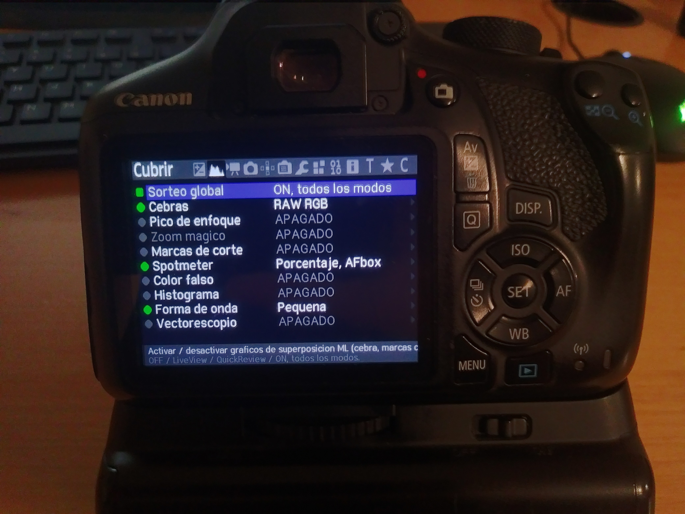

# Magic Lantern Translation
A Magic Lantern module that hijacks the `bmp_puts` function  
and "translates" the output.

## Usage
Drop `mlt.mo` in `ML/modules`.

In order to get menu text items, I logged bmp_printf  
input into a file and removed duplicates and generated  
strings.  

## Help Translate
You can edit translations generated by Google Translate.  
French:  https://docs.google.com/document/d/14A0eS9CKrAxoJHmEkFWCfA-011OPeWJIFAH7dp3Stx8/edit?usp=sharing  
German:  https://docs.google.com/document/d/1munmZIPLASBq0aGodO7J9vumgD9TcqnhCKuxYtc72Y8/edit?usp=sharing  
Spanish: https://docs.google.com/document/d/1cg7afAO2GxoiJX2iHze2Ntu36CBteEo_miUcJ_kXG7c/edit?usp=sharing  

## Help Needed:
- [ ] Manually review translations, and add more translations
- [ ] Case insensitive string searching (possibly ignore symbols too)
- [ ] "Translate" parts of a string, ignoring generated parts

## How's Speed?
Of course, running `strcmp` 100+ times every time the menu is drawn sounds  
very CPU intensive. From my experience, it has no noticible effect. It  
feels just as snappy without it enabled. As for battery life, I'm not 100% sure.  

# Credits
https://github.com/mcufont/mcufont (MIT License)  
(https://github.com/fcambus/spleen) Uses "spleen" 12x24 BDF font, (BSD 2-Clause "Simplified" License)  
